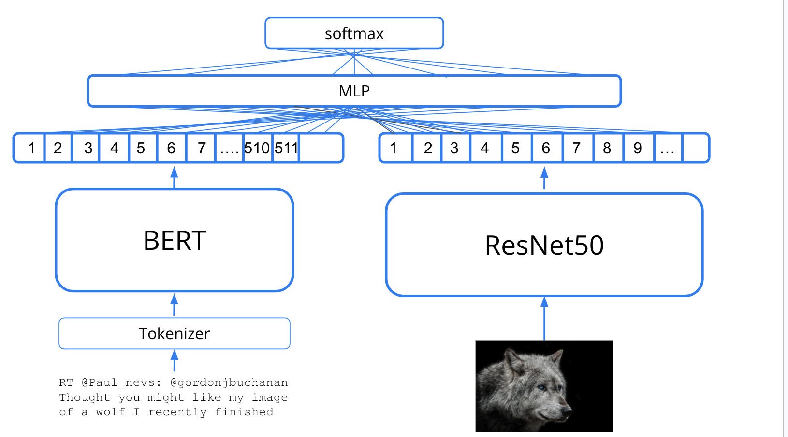
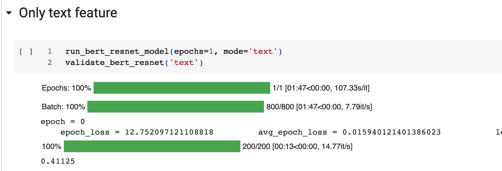
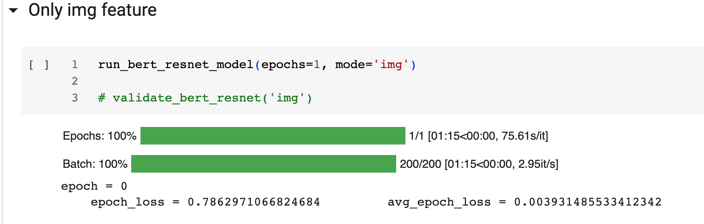
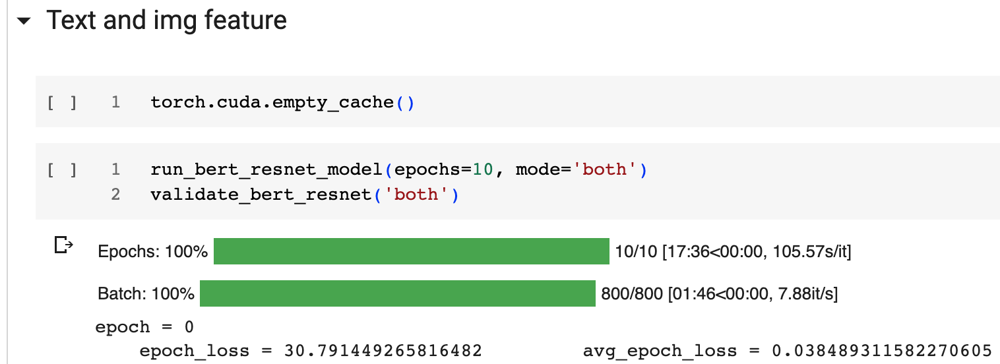
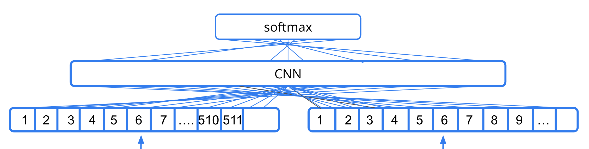
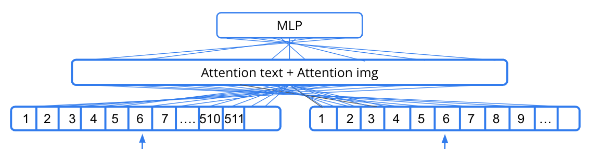

# BertResNet

The `BertResNetModel` is a multimodal deep learning model designed for tasks that require understanding of both text and image inputs. It leverages the power of pre-trained models for both modalities, using BERT for text and ResNet for images.

The model consists of three main components:

1. **Text Encoder**: This component uses a pre-trained BERT model to encode the text input into a high-dimensional feature vector. The BERT model is known for its effectiveness in capturing the contextual information of text.
2. **Visual Encoder**: This component uses a ResNet model, specifically the 'avgpool' output layer, to encode the image input into a high-dimensional feature vector. ResNet is a popular model in computer vision tasks due to its deep architecture and skip connections that help in mitigating the vanishing gradient problem.
3. **Multilayer Perceptron (MLP) Classifiers**: There are three MLP classifiers in the model. The first two are used when only text or image is used for prediction, and they transform the respective feature vector to the final output logits. The third MLP, `mlp_both`, is used when both text and image features are available. It takes in both feature vectors, combines them, and transforms the combined feature vector to the final output logits.

In the forward pass, the model first encodes the text and image inputs using the respective encoders. Depending on the mode specified ('text', 'image', or 'both'), it then uses the appropriate MLP to compute the output logits. The output logits can then be used to compute the loss for training or make predictions during inference.

## Approach




## File structure

```bash
BertResNet
├── BertResNet.ipynb (=> source code notebook)
├── README.md
├── requirements.txt (requires packages)
├── results					 (result prediction store path) 
├── test.csv				 (test dataset metadata csv file)
├── train.csv        (train dataset metadata csv file)
└── val.csv          (val dataset metadata csv file)
```

Open and run the `BertResNet.ipynb` is all you need, when clone to your local file system, ⚠️be careful with the path if the 4th code cell returns error message


## Usage

Prerequisites: `python` 3.8 or later, install all the required packages `pip install -r requirements.txt`

Run the model by simply running the `BertResNet.ipynb` notebook, which includes the dataset preprocess,
model training, model validation, and model testing. Run each code cell to see the whole process.
All the data is stored in the `data` directory, which has two separate subdirectory stores img and sentence.
I have preprocessed the training data metadata into the `train.csv`, `val.csv`, `test.csv` to make the life of 
processing the dataset more feel at ease, just read in the csv is all you need. 

In the model, you can input only text, image, or both text and image in the `BertResNet` model, as the code below:

- Text:

- Image:

  

- Text and Image:


## Main structure of Model

You could change the BertResNetModel to test multiple fusion methods, just replace the `BertResNetModel` in the code cell, like **CNN** as below:

```python
class BertResNetModel(nn.Module):
    def __init__(self, num_labels, text_pretrained='bert-base-uncased'):
        super().__init__()
        self.text_encoder = AutoModel.from_pretrained(text_pretrained)
        self.visual_encoder = ResNetFeatureModel(output_layer='avgpool')
        self.image_hidden_size = 2048
        self.text_hidden_size = self.text_encoder.config.hidden_size
        self.cnn = nn.Sequential(
            nn.Conv1d(1, 32, kernel_size=3, stride=1, padding=1),
            nn.ReLU(),
            nn.MaxPool1d(kernel_size=2, stride=2),
            nn.Conv1d(32, 64, kernel_size=3, stride=1, padding=1),
            nn.ReLU(),
            nn.MaxPool1d(kernel_size=2, stride=2),
            nn.Flatten(),
            nn.Linear(64 * ((self.text_hidden_size + self.image_hidden_size) // 4), num_labels)
        )

    def forward(self, text, image, mode='both'):
        text_output = self.text_encoder(**text)
        text_feature = text_output.last_hidden_state[:, 0, :]
        img_feature = self.visual_encoder(image)

        if mode == 'text':
            feature = text_feature
        elif mode == 'image':
            feature = img_feature
        else:  # 'both'
            feature = torch.cat([text_feature, img_feature], dim=1)

        feature = feature.view(feature.size(0), 1, -1)
        logits = self.cnn(feature)

        return logits
```

Or you could try **attention** methods:

```python
import torch.nn.functional as F

class BertResNetModel(nn.Module):
    def __init__(self, num_labels, text_pretrained='bert-base-uncased', hidden_size=512):
        super().__init__()
        self.text_encoder = AutoModel.from_pretrained(text_pretrained)
        self.visual_encoder = ResNetFeatureModel(output_layer='avgpool')
        self.image_hidden_size = 2048
        self.mlp_text = nn.Linear(self.text_encoder.config.hidden_size, num_labels)
        self.mlp_image = nn.Linear(self.image_hidden_size, num_labels)
        self.mlp_both = TwoInputMLP(self.text_encoder.config.hidden_size, self.image_hidden_size, hidden_size, num_labels)
        self.attention_text = nn.Linear(self.text_encoder.config.hidden_size, 1)
        self.attention_image = nn.Linear(self.image_hidden_size, 1)

    def forward(self, text, image, mode='both'):
        text_output = self.text_encoder(**text)
        text_feature = text_output.last_hidden_state[:, 0, :]
        img_feature = self.visual_encoder(image)

        if mode == 'text':
            logits = self.mlp_text(text_feature)
        elif mode == 'image':
            logits = self.mlp_image(img_feature)
        else:  # 'both'
            # Compute attention weights
            attention_weights_text = F.softmax(self.attention_text(text_feature), dim=1)
            attention_weights_image = F.softmax(self.attention_image(img_feature), dim=1)
            # Apply attention weights to the features
            weighted_text = attention_weights_text * text_feature
            weighted_image = attention_weights_image * img_feature
            # Combine the weighted features
            logits = self.mlp_both(weighted_text, weighted_image)
        return logits
```

